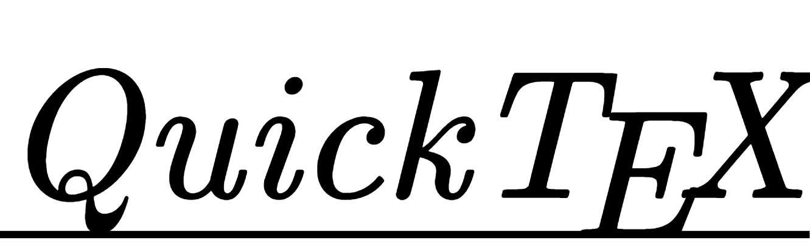
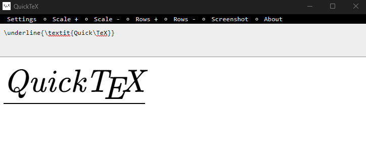
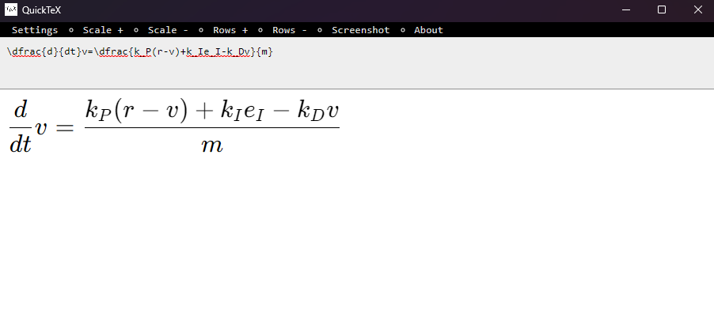

QuickTeX is a desktop tool for quickly rendering KaTeX compatible LaTeX. It also provides a few utilities for scaling and screenshotting the output.

# How to build
This project uses Tauri to display content and Vue as the UI framework. So Rust and Node are required. Follow these steps to build for your own system.

1. Run `npm install` in the root directory
2. Run `npm run tauri build` in the root directory

After running this, the path of the executable will be emitted, should be somewhere in `./src-tauri/target/**/*`

# Showcase
## QuickTeX logo

## Differential equation
